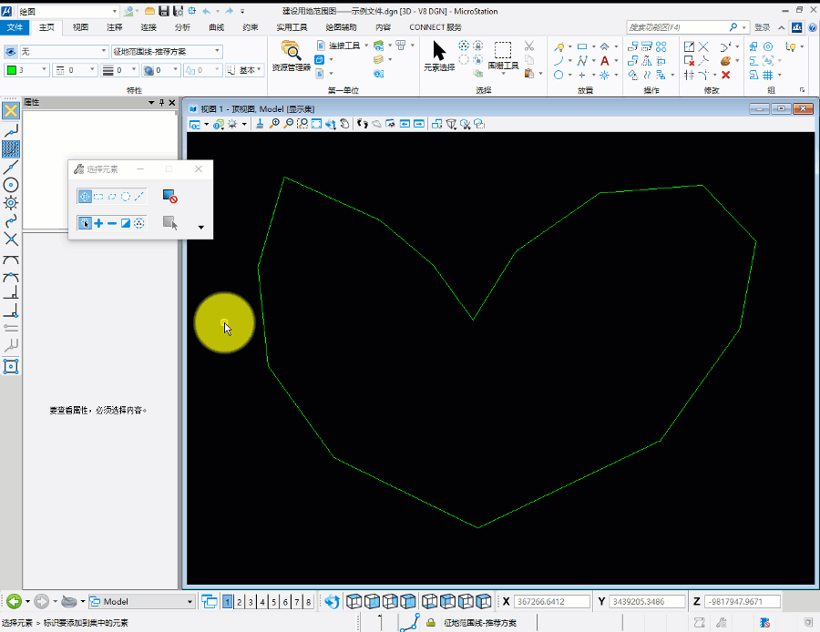
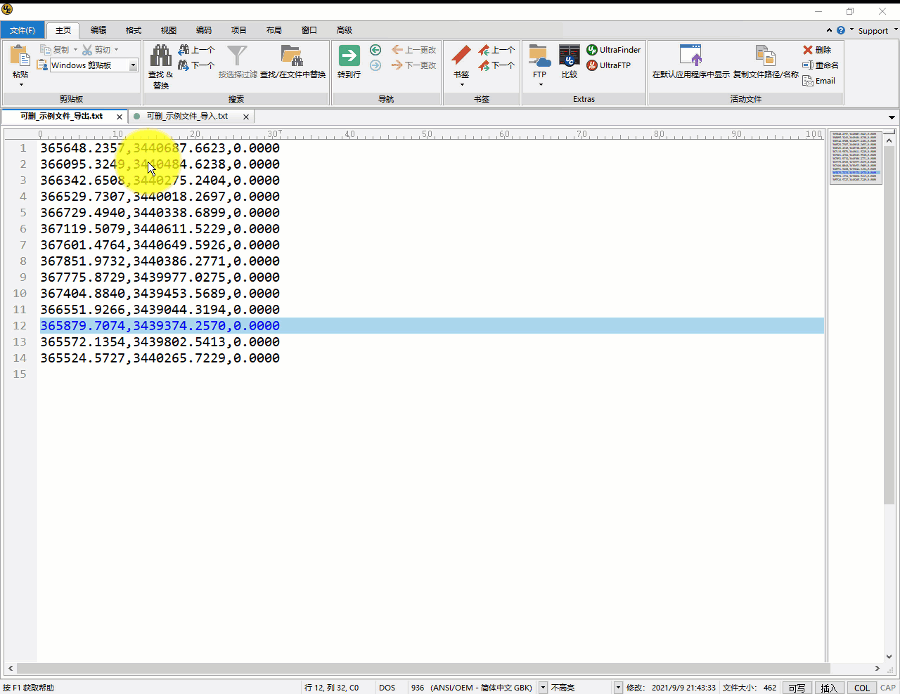
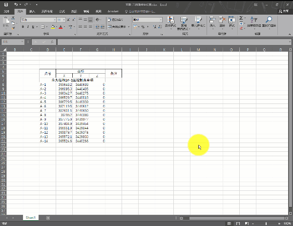

水利水电工程施工专业在绘制建设用地范围图及其对应的施工征地范围控制点坐标表时，征地范围大、片区多往往导致控制点数量巨大，若此时一个个去点击查询标记坐标并编号，那么工作量将十分巨大，可能单单这一项工作就会浪费巨大的人力物力。

那么是否有什么好的方法解决这个问题？批量提取坐标点并编号呢？答案是：有，并且可能还不止一种。今天小编就给大家科普其中的一种方法：利用Microstation导入导出坐标功能批量提取坐标点并编号。废话不多说，进入主题。

# 1 中心思想

导出征地范围线的坐标后编号，再利用坐标将点的编号导入到图中

# 2 操作步骤 

以下，将逐步介绍如何批量导出坐标、编号并将带坐标的编号导入

## 2.1 导出范围线的坐标

首先选择需要导出坐标的范围线，然后利用注释→地形模型→导出坐标，并设置好对应的选项，可将此范围线上点的坐标值导出。

下图为操作过程动图

## 2.2 坐标点编号

此步骤比较简单，即利用excel编号，复制2.1节导出的数据到excel中，并编号（此过程可能存在一个简单的excel分列操作）。

下图为操作过程动图

## 2.3 导入带坐标属性的编号

由于目前Microstation只能导入txt格式的坐标，所以需要将2.2中编了号的坐标导入txt文档中，以便Microstation识别而导入带坐标属性的编号。操作步骤为：注释→地形模型→导入坐标，本步骤的重点是导入坐标时记得选择导入文本，导入顺序为“T X Y Z”

下图为操作过程动图

# 3 需要说明的问题

通过以上步骤便可实现通过Microstation批量提取坐标点并编号，对应施工征地范围控制点坐标表已通过此过程同时在excel中存在了，后期复制粘贴嵌入到图纸中便可。在此说明以下几个问题：

①编号的文本格式与当前激活文本格式一致。

②小编试了很多次，编号文本自动生成时是竖直的，无法旋转一定角度，若要旋转方向以成图，需要手动实现（全选，围绕元素中心旋转即可）

③若导出的坐标每个点均出现两次，只需把此范围线设置成简单形状（简化几何图形后的形状）即可

👉🔚看着你的小伙伴一个点一个点的查询，好累呀，我想有点同情心的人图片都会把这篇教程分享给他吧
